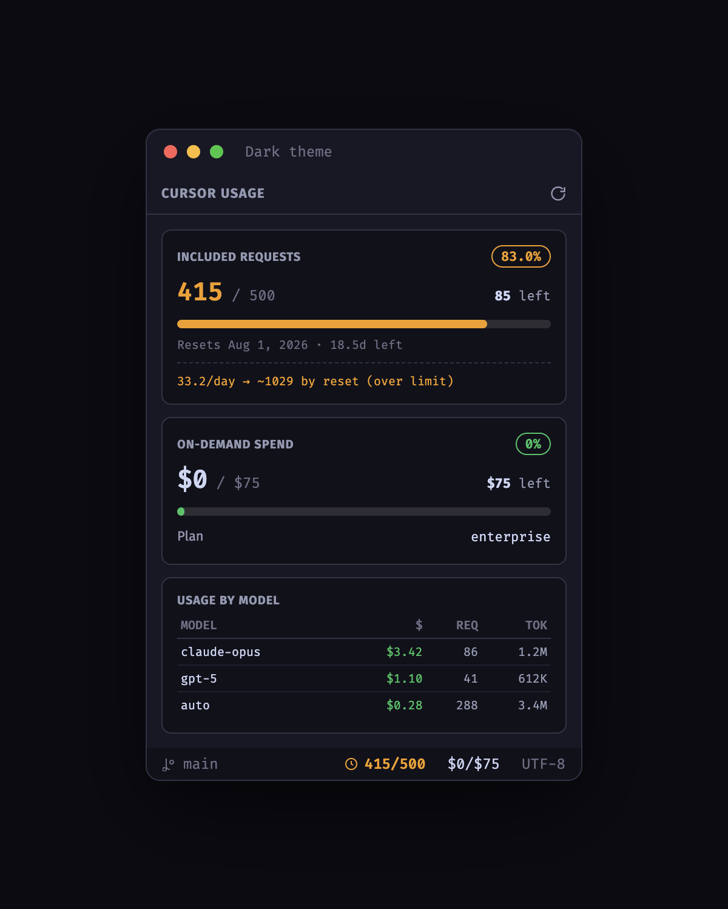
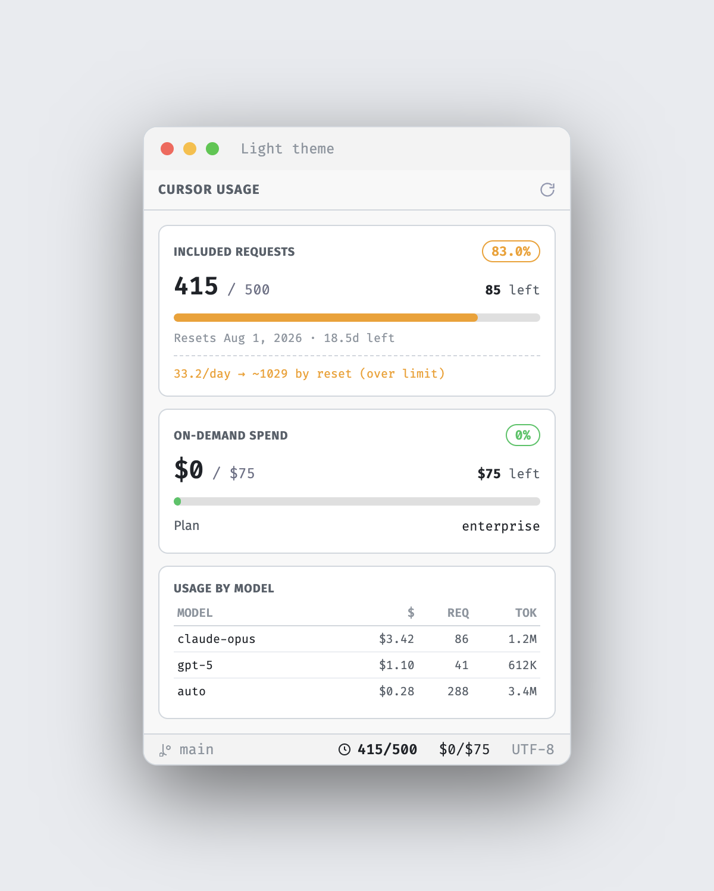

# Cursor Usage

[](https://github.com/udah1/cursor-usage-extension/releases/latest)
[](https://github.com/udah1/cursor-usage-extension/releases)
[](LICENSE)

A tiny, read-only VS Code / Cursor extension that shows your **live Cursor usage** in the
status bar and a sidebar panel — with **no separate login**. It reuses the session token
Cursor already stores locally on your machine.

## Preview

| Dark theme | Light theme |
| :--------: | :---------: |
|  |  |

The whole UI adapts to your VS Code / Cursor theme (dark, light, or high-contrast).

## Features

- **Status-bar badge** — two adjacent items `⏲ 415/500` `$0/$75` (included
  requests used/limit and on-demand spend), so each is colored on its own:
  white → amber (≥80%) → red (≥100%). Click to open details.
- **Sidebar detail panel** (adaptive):
  - Included requests: used / limit (pct), remaining, progress bar (capped at 100%),
    and `Resets <date> (<daysLeft>d left)`.
  - On-demand spend: `$used / $limit`, plan.
  - Optional burn-rate line: `<req>/day → ~<projected> by reset`.
  - Optional per-model table (team accounts).
  - A **Reconnect** hint when auth is missing/expired.
  - **Adaptive layout** — full when the panel is tall, condensed when short.
    Override with `cursorUsage.detailLevel`.

## How authentication works (no login)

The cursor.com dashboard authenticates via a cookie built from Cursor's own local session:

```
WorkosCursorSessionToken=<userSub>::<accessToken>
```

This extension reads that token **read-only** from Cursor's global SQLite store (the same DB
Cursor uses) via the `sqlite3` CLI (`-readonly -json`, only the four `cursorAuth/*` keys — never
the whole file, never read-write, never VACUUM):

| OS      | Path |
| ------- | ---- |
| macOS   | `~/Library/Application Support/Cursor/User/globalStorage/state.vscdb` |
| Linux   | `~/.config/Cursor/User/globalStorage/state.vscdb` |
| Windows | `%APPDATA%/Cursor/User/globalStorage/state.vscdb` |

The cookie/JWT is held **in memory only** — never logged, never persisted. Cursor rotates the
token; on HTTP 401/403 the extension re-reads the keys once and retries once, then shows a
**Reconnect** hint.

> Requires the `sqlite3` CLI on your PATH (preinstalled on macOS; `apt install sqlite3` /
> available on Windows).

## Settings

| Setting | Default | Description |
| ------- | ------- | ----------- |
| `cursorUsage.enable` | `true` | Enable the extension (status bar + polling). |
| `cursorUsage.refreshIntervalSec` | `300` | Refresh interval in seconds (min 60). |
| `cursorUsage.detailLevel` | `"auto"` | `auto` \| `compact` \| `full`. |
| `cursorUsage.showStatusBar` | `true` | Show the status-bar badge. |
| `cursorUsage.checkForUpdates` | `true` | Check GitHub once a day for a newer version and notify. |

Refreshes on activation, then polls on the interval (hard-throttled to at most 1 network fetch
per 60s). Use **Cursor Usage: Refresh** for a manual refresh.

## Build & package

```bash
npm install
npm run build       # bundle with esbuild → dist/extension.js
npm run package     # produces cursor-usage.vsix
```

Install the `.vsix`: Command Palette → **Extensions: Install from VSIX…**

## Commands

- **Cursor Usage: Show** — reveal the detail panel.
- **Cursor Usage: Refresh** — force a refresh (respects the 60s throttle).
- **Cursor Usage: Check for Updates** — check GitHub for a newer release now.

## Updates

The extension checks the [GitHub Releases](https://github.com/udah1/cursor-usage-extension/releases)
API once a day (in the background) and notifies you when a newer version is available, with
**Download** / **Release Notes** / **Skip This Version** actions. Disable via
`cursorUsage.checkForUpdates`, or run **Cursor Usage: Check for Updates** anytime.

## Caveats

These are **undocumented internal** cursor.com endpoints and can change without notice. This is
for personal, read-only use. The extension never writes to `state.vscdb` and never logs or stores
your session token.

## License

MIT
